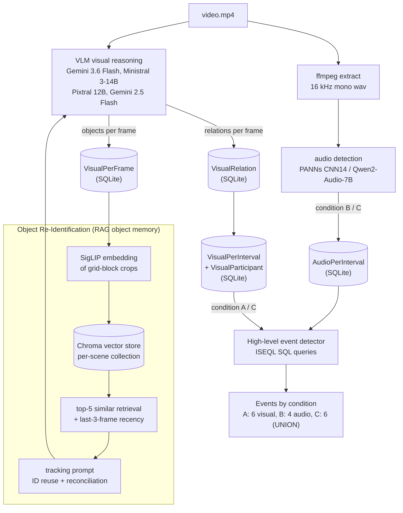

# WATCHOUT ISEQL - Forensic Multimodal Surveillance

> **W**hole-scene **A**udio-visual **T**emporal **C**omplex-event
> **H**andler using **O**ntological **U**nderstanding of **T**emporal ISEQL

A multimodal forensic surveillance framework that detects events through a **three-condition ablation**:

|       | Modality        | Backend                          | Use                                                                                           |
| ----- | --------------- | -------------------------------- | --------------------------------------------------------------------------------------------- |
| **A** | Visual only     | VLM + re-ID + ISEQL (no audio)   | On-camera events requiring temporal chains (handoff, vehicle_escape)         |
| **B** | Audio only      | **PANNs CNN14** / **Qwen2-Audio-7B-Instruct** | Off-camera events the camera cannot see; distinctive audio cues (gunshot, tire_squeal)    |
| **C** | Full multimodal | UNION of A and B (no temporal cross-modal JOIN) | Preserves all detections from both modalities; no recall loss from cross-modal gates          |

### Key innovations
- **First application of Large Audio-Language Model (LALM) for surveillance forensics** - Qwen2-Audio-7B-Instruct
- **Object re-identification** via a persistent RAG object memory (SigLIP image embeddings in ChromaDB) - enables tracking-dependent events (suspicious near vehicle, vehicle escape, handoff)
- **First labeled multimodal forensic surveillance dataset** - 30 scenes generated with Dreamina Seedance (ByteDance) Seedance 2.0, with per-frame ground truth
- **UNION-based multimodal** - C = A U B, no temporal cross-modal JOINs (which reduce recall)
- **Auditable SQL pipeline** - every event is output of a SQL query; no black-box reasoning

### Best result
> **Gemini 3.6 Flash + Qwen2-Audio-7B achieved 30/30 events (F1=0.938)**

---

## Architecture



- **Backend**: FastAPI + Pipenv (Python 3.10)
- **Frontend**: SvelteKit + TypeScript + shadcn-svelte
- **Audio**: PANNs CNN14 (CPU, AudioSet) or Qwen2-Audio-7B-Instruct (GPU, LALM)
- **VLM**: Gemini 3.6 Flash (best of 4 tested), others: Ministral 3-14B, Pixtral 12B, Gemini 2.5 Flash
- **Eval**: 3-condition harness, 30 curated scenes

---

## Object Re-Identification

Without re-ID, every VLM call assigns new IDs to the same person/vehicle. Short, single-frame intervals cannot satisfy the ISEQL duration thresholds for events that require a persistent identity over time (suspicious near vehicle, vehicle escape, handoff). Prior work (VIS MODE) reported zero events from this failure.

**Re-ID mechanism** (RAG over a persistent object memory; in `backend/src/service/impl/visual_service_impl.py` + `backend/src/utils/object_memory.py`):

1. **Persistent object memory**: every sampled frame's detected objects are embedded (SigLIP, `google/siglip-base-patch16-224`) from their grid-block crops and upserted into a per-scene Chroma collection (cosine space) stored under `data/ablation_*/vector_db`.
2. **Bounded tracking prompt = recency + retrieval**: each frame the VLM tracking prompt is built from (a) the last 3 frames' objects (a sliding recency buffer) plus (b) the top-5 most similar objects retrieved from all earlier frames by embedding distance.
3. **ID reuse**: the VLM reuses a prior ID when the same class appears in overlapping/close grid blocks; a deterministic reconciliation pass re-identifies objects the VLM marked new via block-overlap → close-blocks → class-only fallbacks, and per-frame state is rebuilt from the buffer + Chroma so an empty VLM frame no longer breaks ID continuity.

**Impact**: Re-ID unlocks tracking-dependent events: with Gemini 3.6 Flash, suspicious near vehicle rises 0/5 → 5/5, vehicle escape 0/5 → 3/5, and handoff 0/5 → 5/5, lifting visual F1 from 0.622 (no re-ID) to 0.885.

---

## Evaluation Dataset

The first labeled multimodal forensic surveillance dataset, generated using Dreamina Seedance (ByteDance's text-to-video service, Seedance 2.0 model).

| Property | Value |
|----------|-------|
| Source | Dreamina Seedance (ByteDance), Seedance 2.0 |
| Scenes | 30 curated surveillance scenarios (10s each, 24 fps, 1280x720) |
| Event types | fight, gunshot_or_explosion, vehicle_escape, vehicle_collision, suspicious_near_vehicle, handoff |
| Annotations | Per-frame visual relations, audio classes, event-level ground truth (TP/FN/FP/TN) |
| Storage | Excel ground truth + SQLite databases per VLM/audio combination |

No public dataset existed for multimodal forensic surveillance with temporal interval annotations.

## Visual: VLM Comparison (30 scenes)

| VLM                  | Re-ID | F1     | TP | FP | FN |
|----------------------|-------|--------|----|----|----|
| **Gemini 3.6 Flash** | Yes   | **0.885** | 27 | 4  | 3  |
| Ministral 3-14B      | Yes   | 0.746  | 22 | 7  | 8  |
| Gemini 2.5 Flash     | Yes   | 0.737  | 21 | 6  | 9  |
| Pixtral 12B          | Yes   | 0.667  | 19 | 8  | 11 |

Without re-ID (ablation F1/TP): Gemini 3.6 Flash 0.622/14, Pixtral 12B 0.553/13, Ministral 3-14B 0.531/13, Gemini 2.5 Flash 0.419/9. Re-ID mainly adds suspicious near vehicle, vehicle escape, and handoff, which require a persistent identity over time.

---

## Audio: LALM vs CNN (20 audio-relevant scenes)

| Model             | Type    | F1     | TP | FP | FN |
|----------------------|---------|--------|----|----|----|
| **Qwen2-Audio-7B**   | **LALM**| **0.788** | 13 | 0  | 7  |
| PANNs CNN14          | CNN     | 0.400  | 5  | 0  | 15 |
This is the **first application of a Large Audio-Language Model for surveillance forensic event detection**. No prior work found on arXiv or Google Scholar.

---

## Multimodal: Ablation Results (30 scenes)

Best window/hop per pair (all tied configs shown; all 8 window/hop configs per pair are in `data/analysis_*/summary.xlsx`, and the full ranked 64-combination ablation is in the thesis appendix):

| VLM + Audio Model                     | Window/Hop (s)                | F1     | Precision | Recall | TP | FP | FN |
|---------------------------------------|-------------------------------|--------|-----------|--------|----|----|----|
| **Gemini 3.6 Flash + Qwen2-Audio**    | **5.0/2.5**                   | **0.938** | **0.882** | **1.000** | 30 | 4  | 0  |
| Gemini 3.6 Flash + PANNs              | 5.0/5.0, 10.0/5.0, 10.0/10.0 | 0.903  | 0.875     | 0.933  | 28 | 4  | 2  |
| **Ministral 3-14B + Qwen2-Audio**     | 5.0/2.5                       | **0.825** | 0.788     | 0.867  | 26 | 7  | 4  |
| Gemini 2.5 Flash + Qwen2-Audio        | 5.0/2.5                       | 0.820  | 0.806     | 0.833  | 25 | 6  | 5  |
| Pixtral 12B + Qwen2-Audio             | 5.0/2.5                       | 0.794  | 0.758     | 0.833  | 25 | 8  | 5  |
| Ministral 3-14B + PANNs               | 5.0/5.0, 10.0/5.0, 10.0/10.0 | 0.767  | 0.767     | 0.767  | 23 | 7  | 7  |
| Gemini 2.5 Flash + PANNs              | 5.0/5.0, 10.0/5.0, 10.0/10.0 | 0.759  | 0.786     | 0.733  | 22 | 6  | 8  |
| Pixtral 12B + PANNs                   | 5.0/5.0                       | 0.712  | 0.724     | 0.700  | 21 | 8  | 9  |

Thesis claim C >= max(A, B) holds on all scenes across all providers.

---

## Events detected, by condition

|       | Condition       | Query set                                                                                                                    |
| ----- | --------------- | ---------------------------------------------------------------------------------------------------------------------------- |
| **A** | Visual only     | 6 visual SQL queries (fight, vehicle_escape, suspicious_near_vehicle, handoff, vehicle_collision, gunshot_or_explosion) |
| **B** | Audio only      | 4 audio-only SQL queries (fight, gunshot_or_explosion, vehicle_escape, vehicle_collision)                                             |
| **C** | Full multimodal | 6 SQL queries (4 via UNION of AUB, 2 visual-only for events with no audio correlate) |

The full set is authored in the **Events (ISEQL)** configurator, stored in the
`EventSpec` registry (SQLite), and exposed via `GET /api/events/types`.

---

## Running (per-profile)

All run targets are **profile-aware** and driven by a single `PROFILE` variable
(`local`, `hpc`, `docker`, `mac`), which selects:
- the backend runner (local conda auto-detect + pipenv / remote GPU node / macOS brew + CPU pipenv),
- an optional `config.<profile>.yml` overlay on top of the base `config.yml` (only `hpc` and `docker` override it),
- the FFmpeg/`LD_LIBRARY_PATH` setup (auto-provisioned via conda, or brew on macOS).

`make local` targets **Linux (including WSL2)**. It auto-detects an existing
conda install (`anaconda3`/`miniconda3`, else installs Miniconda3), creates a
`py310` env with Python 3.10 + FFmpeg, and runs the backend through pipenv.
It relies on `bash`, `make` and `conda`, so it does not run on native Windows.

```bash
make local      # Linux/WSL2: auto-detect conda -> py310 + ffmpeg -> pipenv backend + frontend
make mac        # macOS: brew ffmpeg + Pipfile.mac (CPU/MPS torch, no CUDA/bitsandbytes)
make hpc        # HPC: backend on the GPU node, frontend on the login node
make docker     # docker compose (any host with Docker, incl. native Windows)
```

Windows without WSL: use `make docker` (see the Docker section) or run inside
WSL2 with the `local` profile.

Each profile exposes granular targets (e.g. `make hpc-backend`, `make hpc-frontend`,
`make hpc-eval`, `make hpc-status`, `make hpc-stop`, `make hpc-clean`).

### macOS

```bash
brew install ffmpeg   # or `make mac` auto-installs via Homebrew if missing
make mac              # backend (Pipfile.mac, CPU/MPS) + frontend
```

macOS has no CUDA, so `make mac` installs torch/torchaudio/torchvision from
PyPI (CPU/MPS) via `backend/Pipfile.mac` (no `pytorch-cu121` wheel index, no
`bitsandbytes`). LALM `4bit`/`8bit` quantization is unavailable on macOS, so
use `quantization: none` (the CNN14/PANNs audio path works unchanged).

### HPC + ngrok (public access)

On the HPC cluster, GPUs/Ollama live on the compute node while the login node
runs the frontend. `make hpc` starts the backend on the GPU node (via SSH tunnel
to `localhost:8000`) and the frontend on the login node (`:5173`). On first run it
automatically bootstraps the env (conda `py310`, FFmpeg, pipenv venv).

```bash
# 1) start the app (backend on GPU node, frontend on login node)
make hpc

# 2) open a public tunnel to the frontend (also proxies /api to the backend)
ngrok http 5173
# -> copy the https://....ngrok-free.dev URL from http://127.0.0.1:4040/api/tunnels

# 3) set the tunnel host in frontend/.env (gitignored) if needed:
#    NGROK_HOST=<your-ngrok-subdomain>.ngrok-free.dev

# 4) stop everything
make hpc-stop
```

`make hpc-status` reports backend / frontend / Ollama / ngrok state.

### Docker

```bash
make docker
```

Open <http://localhost:5173>.

---

## Using the app

Events, relations, and audio classes are all **user-configurable**
through the web UI (no hardcoded definitions in the backend):

- **Events (ISEQL)**: author events by writing ISEQL query text
  (`π`/`σ` projections and selections, `∨` disjunctions, operators
  `Bef Aft SP EF DJ RDJ LOJ ROJ` with `δ/ε/ζ/η/ρ`, and set ops `\ ∪ ∩`).
  Each event is stored as a model in the `EventSpec` registry and compiled to
  SQL at detection time.
- **Relations**: define the visual relation vocabulary (name, class IDs,
  description) used by the VLM relation prompt.
- **Audio events**: configure the audio class taxonomy (classes, keywords)
  for the audio model.

Class naming is consolidated: **all vehicles (cars, trucks, vans, buses,
motorcycles, bicycles) use the single class `vehicle`**, so ISEQL queries simply
write `arg1="vehicle"`.

---

## Quick start

Requires: `python3.10`, `pipenv`, `node >= 18`, `pnpm`, `ffmpeg`, `libsndfile`, `git`
(plus `bash` and `make`; see "Running (per-profile)" for macOS, HPC, Docker and Windows).

```bash
git clone <repo-url> multimodal-surveillance-iseql
cd multimodal-surveillance-iseql

make backend    # pipenv install --dev
make frontend   # pnpm install
make local      # Linux/WSL2: boots backend on :8000 and frontend on :5173
```

Other profiles: `make mac` (macOS), `make hpc` (GPU cluster), `make docker`
(Docker, also native Windows). See "Running (per-profile)" below.

Then open <http://localhost:5173>, upload a video, and pick a **condition** (A / B / C).

---

## Makefile targets

| Target                              | What it does                                                      |
| ----------------------------------- | ----------------------------------------------------------------- |
| `make backend` / `make frontend`    | Install Python / JS deps                                          |
| `make local`                        | Gen. machine: auto-detect conda -> py310+ffmpeg -> pipenv backend + frontend |
| `make mac`                          | macOS: brew ffmpeg + Pipfile.mac (CPU/MPS torch) + frontend       |
| `make hpc`                          | HPC: backend on GPU node + frontend on login node                 |
| `make docker`                       | Build and run both services via `docker compose`                  |
| `make <profile>-backend`            | Run only the backend for a profile                                |
| `make <profile>-frontend`           | Run only the frontend for a profile                               |
| `make <profile>-eval`               | Run the evaluation notebook queue for a profile (via `eval.sh`)   |
| `make <profile>-status`             | Show backend / frontend / Ollama / ngrok state for a profile      |
| `make <profile>-stop`               | Stop a profile's services                                         |
| `make <profile>-clean`              | Clean a profile's artifacts                                       |
| `make status` / `make stop`         | Status / stop all profiles                                        |
| `make clean`                        | Clean all artifacts                                               |

Profiles: `local`, `mac`, `hpc`, `docker`. `PROFILE` can also be set
directly, e.g. `PROFILE=hpc bash scripts/start.sh backend`.

---

## Tests

The ISEQL engine (parser, compiler, args<->ClassID mapping, text<->model
round-trips) has a pytest suite that runs without the full ML stack; the
frontend builder's model-conversion logic has a Vitest suite. Both are wired
into the Makefile and run automatically on GitHub Actions (with coverage
uploaded to Codecov).

```bash
make test          # backend (pytest) + frontend (vitest)
make test-backend  # backend only
make test-frontend # frontend only
make test-cov      # both, with coverage (coverage.xml / coverage/lcov.info)
```

Or run the suites directly:

```bash
cd backend  && pipenv run pytest          # pytest (111 tests)
cd frontend && pnpm test                  # vitest (35 tests)
cd frontend && pnpm run check && pnpm run build   # typecheck + production build
```

Test layout: `backend/tests/` (pytest) and `frontend/src/lib/iseql-model.test.ts`
(vitest). The backend suite stubs the SQLite `AppConfig` DB in
`tests/conftest.py`, so no GPU / VLM / audio models are required.

CI: `.github/workflows/ci.yml` runs the backend suite (Python 3.10, minimal
`pytest` + `pytest-cov`) and the frontend suite (typecheck, tests, build) on
push/PR, then uploads `backend/coverage.xml` and `frontend/coverage/lcov.info`
to [Codecov](https://codecov.io). Public repos use GitHub OIDC for the upload;
private repos need a `CODECOV_TOKEN` secret.

---

## Project layout

```
multimodal-surveillance-iseql/
├── backend/             FastAPI + Pipenv
│   └── src/
│       ├── api/             analysis, schema, events, ISEQL, config, controllers
│       ├── models/          analysis (Condition enum)
│       ├── service/         ABC interfaces (audio, visual, events, interval, ...)
│       │   └── impl/        service implementations (only *_service_impl.py)
│       ├── iseql/           ISEQL engine: helpers (operators+SQL), parser, compiler, facade
│       └── utils/           database, config, VLM client, geometry_helpers, logger
├── frontend/            SvelteKit + TypeScript + shadcn-svelte
├── docs/                iseql_event_queries.md (canonical event queries)
├── experiments/         Evaluation notebooks and scene definitions
│   ├── evaluation_scenes.md
│   └── notebooks/       22 evaluation notebooks (VLM, audio, multimodal)
├── reports/
│   ├── slides/           Defense slides (Beamer)
│   └── thesis/           Master's thesis (LaTeX)
├── data/                Runtime artefacts (uploads, DBs, analysis XLSX, audio)
│   ├── analysis_*/       Per-VLM/audio ablation results
│   ├── geometry_plugins/ User-uploaded Python geometry event plugins
│   └── videos/eval/      30 curated evaluation scenes
├── Makefile             Root convenience
├── docker-compose.yml
└── LICENSE
```

---

## API endpoints (backend)

OpenAPI docs are auto-generated at `/docs` and `/redoc` when the backend is running.

| Method | Path                        | Purpose                                                             |
| ------ | --------------------------- | ------------------------------------------------------------------- |
| `GET`  | `/api/health`               | Liveness, includes the three conditions                             |
| `GET`  | `/api/schema`               | Table names, per-condition event catalogue                          |
| `GET`  | `/api/events/types`         | Per-condition event-type catalogue                                  |
| `POST` | `/api/analysis/start`       | Start a new analysis (multipart: video + `condition=A\|B\|C`)       |
| `GET`  | `/api/analysis/{id}/logs`   | SSE stream of stage logs                                            |
| `GET`  | `/api/analysis/{id}/status` | Current stage + condition + counters                                |
| `POST`  | `/api/analysis/{id}/detect` | Run a high-level event detector (dispatches by the run's condition) |
| `GET`  | `/api/db/download`          | Stream the SQLite database                                          |
| `POST` | `/api/db/upload`            | Upload a pre-existing `.db`                                         |
| `GET/POST/PUT/PATCH/DELETE` | `/api/events` + `/api/events/{id}` | Author events in the ISEQL registry (`condition`, `enabled`, `model_json`) |
| `POST` | `/api/iseql/compile`        | Compile ISEQL query text to SQL (editor preview)                    |
| `POST` | `/api/iseql/preview`        | Render a stored event model back to ISEQL text                      |
| `GET/PUT` | `/api/config/{section}`  | Read/write config sections (identity, preprocessing, audio_taxonomy, relation_vocab, prompts) |
| `GET/POST/DELETE` | `/api/geometry/plugins` | List, upload, and delete track-geometry Python plugins            |

---

## Attribution

- **Object re-identification** and **first LALM for surveillance**: Ghiffary R. (this thesis)
- VIS MODE framework (predecessor, ECCV 2026 demo): Crescitelli, Persia, Cipriani, Pea, *VIS MODE: Complex Event Detection from VLM-Based Video Observations*. Prior work suffered from zero-event bug (no re-ID, so tracking-dependent events were missed) and unverifiable claims (no labeled ground truth). This project fixes both.
- PANNs CNN14: Kong et al., *PANNs: Large-scale Pretrained Audio Neural Networks for Audio Pattern Recognition*, IEEE/ACM TASLP 2020.
- Qwen2-Audio-7B-Instruct: Chu et al., *Qwen2-Audio Technical Report*, 2024.

---

## License

Apache 2.0. See `LICENSE`.
